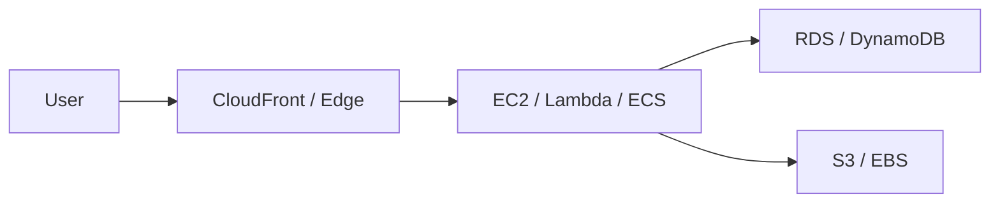

# 🌐 AWS Introduction

## 🌍 What is AWS?
AWS (Amazon Web Services) is Amazon’s cloud computing platform that provides on-demand services for computing, storage, networking, databases, security, analytics, and application deployment. It allows organizations to build, deploy, and scale applications without having to own physical data centers.

AWS is important because it provides a flexible and scalable environment for:
- running websites and applications
- storing and processing large amounts of data
- hosting databases and enterprise workloads
- building secure and highly available systems
- enabling global delivery of applications with low latency

In simple terms, AWS gives you access to a vast ecosystem of cloud services that can be combined to design modern applications.

### 🧩 Why AWS became dominant
AWS became widely adopted because it offers:
- rapid provisioning of resources
- pay-as-you-go pricing
- global reach with low latency
- managed services that reduce operational overhead
- strong security and compliance capabilities

### 🏗️ High-level architecture view


---

## 🏗️ Why AWS is Important
AWS is widely used because it helps organizations:
- build applications faster with ready-made services
- reduce infrastructure management overhead
- scale resources on demand based on traffic and usage
- improve reliability and availability with distributed infrastructure
- support global deployment with less complexity
- reduce upfront capital expenditure on hardware

Unlike traditional on-premises environments, AWS lets businesses pay for what they use and scale resources quickly when demand increases.

---

## 🌐 AWS Global Infrastructure
AWS is organized into a global network of locations designed for reliability and performance.

### 🧭 Region
A region is a geographical area that contains multiple data centers. Examples include:
- us-east-1
- eu-west-1
- ap-south-1

Regions are chosen based on:
- compliance and legal requirements
- latency for end users
- business continuity and disaster recovery strategies
- data residency requirements

### 🧱 Availability Zone (AZ)
An Availability Zone is one or more isolated data centers inside a region. AWS recommends deploying applications across multiple AZs to improve fault tolerance and resilience.

### 📍 Edge Location
An edge location is a site used by services like CloudFront to cache content closer to end users. This reduces latency and improves the performance of websites and applications.

### 🔄 Simple Architecture View
```text
User --> CloudFront Edge Location --> AWS Region --> Multiple AZs --> EC2 / RDS / S3
```

---

## 🧩 Core AWS Service Categories
AWS offers many services, but they can be grouped into categories.

### 💻 Compute
Used to run applications and workloads.
- EC2: virtual servers in the cloud
- Lambda: serverless compute for event-driven workloads
- ECS and EKS: container orchestration services

### 🗄️ Storage
Used to store data safely and scale easily.
- S3: object storage for files, backups, media, and static websites
- EBS: block storage for EC2 instances
- Glacier: archival storage for long-term retention

### 🗃️ Database
Used to store structured or unstructured application data.
- RDS: managed relational databases
- DynamoDB: managed NoSQL database

### 🌐 Networking
Used to connect applications and users.
- VPC: private virtual network inside AWS
- Route 53: DNS service
- CloudFront: content delivery network

### 🔐 Security
Used to secure identities and data.
- IAM: manage users, roles, and permissions
- KMS: encryption key management
- WAF: protect web applications from common attacks

---

## 🔐 Shared Responsibility Model
AWS follows a shared responsibility model.

### AWS Responsibility
AWS is responsible for the security of the cloud, which includes:
- physical data centers
- hardware and networking infrastructure
- virtualization and underlying cloud services

### Customer Responsibility
The customer is responsible for security in the cloud, which includes:
- configuring IAM properly
- securing application data
- managing access permissions
- enabling encryption where required
- monitoring logs and activities
- patching operating systems and applications where applicable

This model is extremely important in AWS because many security failures happen when customers do not configure services securely.

---

## 🧠 Key Concepts for Beginners
Understanding the following ideas is essential for learning AWS properly.

### 1. Regions and AZs affect architecture decisions
A wrong region choice can impact performance, cost, and compliance. Deploying resources across multiple AZs improves resilience.

### 2. Services can be public, private, or hybrid
Some services are exposed to the internet, while others are kept internal to a private network. Architects must decide based on security and access requirements.

### 3. Security must be designed from the start
Security is not only about firewalls. It includes IAM, network controls, encryption, logging, monitoring, and incident response.

### 4. Cloud architecture must balance trade-offs
A good AWS architecture considers:
- performance
- scalability
- reliability
- security
- cost

There is no single perfect design. The best architecture depends on business needs and technical constraints.

---

## 📚 Common AWS Use Cases
AWS is used for many real-world scenarios:
- hosting websites and web applications
- running enterprise applications
- storing backups and logs
- building analytics platforms
- supporting mobile and SaaS applications
- managing disaster recovery environments

A simple example is a web application that uses:
- EC2 or Lambda to run the application logic
- S3 to store images and files
- RDS or DynamoDB for database needs
- CloudFront to improve content delivery speed
- IAM for secure access control

---

## 🧪 Practical Part

### 1. 🛠️ Manual labs
1. Create an AWS account and enable MFA.
2. Create an IAM user with programmatic access.
3. Launch a simple EC2 instance.
4. Create an S3 bucket and upload a sample file.
5. Review billing and cost explorer basics.

### 2. 🧱 Terraform example
```hcl
terraform {
  required_providers {
    aws = {
      source  = "hashicorp/aws"
      version = "~> 5.0"
    }
  }
}

provider "aws" {
  region = "us-east-1"
}

resource "aws_s3_bucket" "demo" {
  bucket = "demo-bucket-123456"
}
```

---

## 📝 Exam Notes
- Choose the right region based on compliance, latency, and cost.
- High availability usually depends on deploying resources across multiple AZs.
- Understand the purpose of each AWS service before memorizing the details.
- In interviews and exams, focus on practical use cases and architectural reasoning.
- Always think in terms of scalability, security, availability, and cost.

