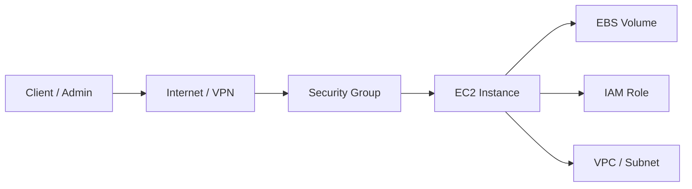
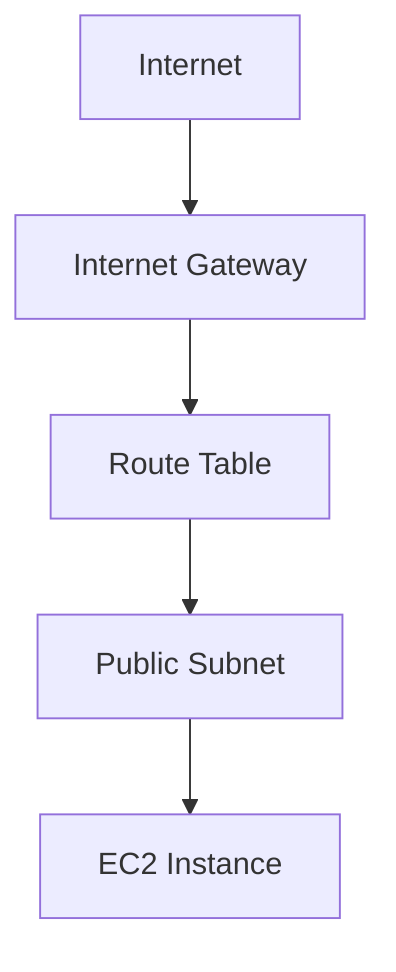
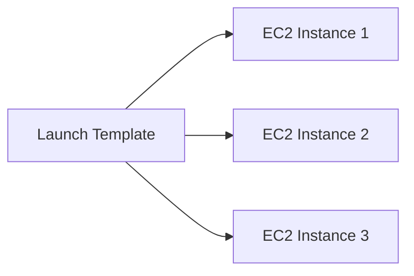
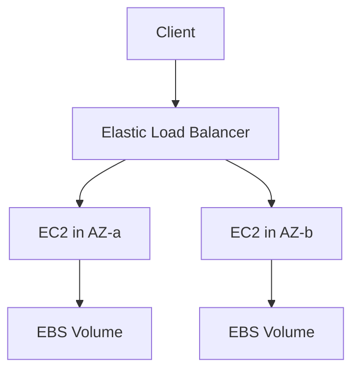

# 🖥️ EC2 and Launch Templates

## 💡 What is Amazon EC2?
Amazon Elastic Compute Cloud (EC2) is AWS’s core compute service that provides resizable virtual servers in the cloud. It lets you launch virtual machines on demand without buying or maintaining physical hardware.

EC2 is commonly used for:
- hosting web applications and APIs
- running enterprise workloads and internal applications
- deploying application servers and middleware
- supporting development, testing, and staging environments
- serving as a backend for databases, caching systems, and microservices

Unlike traditional servers, EC2 gives you flexibility to choose the operating system, instance size, storage type, networking setup, and scaling behavior based on workload demand.

### 🧠 Why EC2 is important
EC2 is the foundation of many AWS workloads because it provides:
- on-demand compute capacity
- flexibility in operating systems and software
- easy scalability with Auto Scaling
- integration with other AWS services like IAM, VPC, EBS, S3, CloudWatch, and ELB

### 🧩 EC2 architecture overview


---

## 🧱 EC2 Core Concepts

### 1. 🧮 Instance Types
EC2 instance types are classified based on workload needs. Choosing the right type affects both price and performance.

| Family | Best for | Typical use case |
|---|---|---|
| General purpose | Balanced CPU and memory | Web servers, small databases, dev/test |
| Compute optimized | High CPU performance | Batch processing, gaming servers, analytics |
| Memory optimized | Large memory workloads | SAP, in-memory databases, JVM-based apps |
| Storage optimized | High disk throughput / IOPS | NoSQL databases, log processing, data warehouses |
| Accelerated computing | GPU/FPGA workloads | Machine learning, video processing, HPC |

Important note: instance families are not interchangeable. A compute-optimized instance is not ideal for memory-heavy applications, and vice versa.

### 2. 🖼️ AMI (Amazon Machine Image)
An AMI is a preconfigured template used to launch an EC2 instance. It contains:
- the operating system image
- preinstalled software or packages
- application configuration
- launch permissions and metadata

Common AMIs include:
- Amazon Linux
- Ubuntu
- Windows Server
- Red Hat Enterprise Linux
- custom AMIs created by your team

A custom AMI is useful when you want to standardize your environment and avoid repetitive setup.

### 3. 🔐 Security Groups
Security Groups are virtual firewalls attached to EC2 instances.

They control:
- inbound traffic
- outbound traffic
- allowed ports and protocols
- source IP or source security group

Key points:
- they are stateful
- they allow rules, but do not block by default unless you explicitly configure them
- they are attached at the instance level (or ENI level)

Example: if you allow inbound TCP 80 from 0.0.0.0/0, the instance can receive web traffic on port 80.

### 4. 🔑 Key Pairs
Key pairs are used for secure SSH access to Linux instances and RDP access to Windows instances.

They are important because:
- they provide secure authentication
- they avoid password-based login
- they are required for command-line access in many Linux setups

### 5. 🌐 Elastic IPs
An Elastic IP is a static public IPv4 address that can be assigned to an EC2 instance.

It is useful when:
- you need a stable public IP for your application
- you want to preserve the same IP even after instance replacement
- you need predictable public endpoint access

Note: Elastic IPs are not required for every instance. If your instance already has a public IP and you do not need a fixed address, you may not need one.

### 6. ⚙️ User Data
User data is a script that runs automatically when the instance starts for the first time.

Typical uses:
- install packages
- update the OS
- configure web servers
- bootstrap applications

Example use case: running a shell script that installs Nginx and starts the service when the instance launches.

### 7. 🧾 IAM Roles for EC2
IAM roles allow EC2 instances to securely access AWS services without storing long-term credentials on the server.

Examples:
- reading from S3
- writing logs to CloudWatch
- accessing Secrets Manager

This is a best practice because it improves security and simplifies credential management.

---

## 💾 Storage Options for EC2
EC2 instances can use different storage types depending on workload requirements.

### 🧊 Amazon EBS
Amazon Elastic Block Store (EBS) provides persistent block storage for EC2.

Features:
- survives instance stop/start
- suitable for OS volumes and application data
- supports snapshots for backup and recovery
- commonly used for root volumes and database data

### 💽 Instance Store
Instance Store is temporary local storage physically attached to the host machine.

Features:
- very fast local storage
- best for temporary data, cache, or scratch space
- data is lost when the instance is stopped or terminated

### 🔄 EBS vs Instance Store
```text
EC2 Instance
├── Root Volume (EBS or Instance Store)
├── Additional EBS Volumes
└── Temporary Instance Store
```

### 📦 EBS Volume Types
Common EBS volume types include:
- General Purpose SSD (gp3/gp2) for most workloads
- Provisioned IOPS SSD (io1/io2) for high-performance databases
- Throughput Optimized HDD (st1) for big data workloads
- Cold HDD (sc1) for infrequently accessed data

### 🧠 Important difference
- EBS is persistent storage
- Instance Store is temporary storage
- For production systems, EBS is usually preferred for important data

---

## 🌐 Networking and EC2
EC2 does not work in isolation. It usually lives inside a VPC and a subnet.

### 🔗 How EC2 fits into a VPC


Important networking concepts:
- VPC defines your private cloud network
- Subnet determines where the instance is placed
- Public subnet allows direct internet access
- Private subnet is used for internal services
- Route tables define network paths

### 🛡️ Security Groups vs NACLs
- Security Groups are stateful and operate at the instance level
- Network ACLs are stateless and operate at the subnet level
- Security Groups are usually the first layer of defense for EC2

---

## 🚀 Launch Templates
Launch Templates are used to standardize EC2 instance launches. They define reusable launch settings such as:
- AMI ID
- instance type
- subnet
- security groups
- key pair
- user data scripts
- IAM instance profile
- EBS volume configuration

They help teams create consistent and repeatable infrastructure deployments.

### ✅ Why Launch Templates are useful
- reduce manual configuration errors
- simplify Auto Scaling configurations
- standardize deployment practices
- make infrastructure automation easier
- allow versioning of launch configurations

### 🔄 Launch Templates vs Launch Configurations
Launch Configurations are older and mostly replaced by Launch Templates.

Use Launch Templates when you want:
- version control
- better AWS integration
- improved flexibility for Auto Scaling and EC2 launches

### 🧩 Launch Template example


---

## 📈 EC2 and High Availability
EC2 can be part of a highly available architecture when used with:
- multiple instances across different Availability Zones
- Elastic Load Balancing
- Auto Scaling Groups
- EBS snapshots and backups

### 🏗️ High availability pattern


This improves fault tolerance and protects the application from a single-instance failure.

---

## 💰 EC2 Pricing Models
EC2 pricing varies based on usage model.

### 1. On-Demand
- pay per second/hour
- flexible and easy to start
- ideal for short-term or unpredictable workloads

### 2. Reserved Instances
- lower cost for predictable long-term usage
- good for steady-state applications

### 3. Savings Plans
- flexible pricing model for compute usage
- helps reduce costs for long-running workloads

### 4. Spot Instances
- use spare AWS capacity at discounted price
- suitable for fault-tolerant workloads like batch processing

### 5. Dedicated Hosts / Dedicated Instances
- used when compliance or licensing requirements demand dedicated hardware

A common exam point: Spot is cheaper, but instances can be interrupted by AWS when capacity is needed elsewhere.

---

## 🛡️ Best Practices for EC2
- use IAM roles instead of embedding long-term credentials in instances
- prefer EBS for persistent data storage
- restrict access with Security Groups and least-privilege rules
- place internal services in private subnets when possible
- use Auto Scaling for workload fluctuations
- monitor CPU, memory, disk, and network metrics regularly
- use CloudWatch alarms and backups for production systems
- use tagging to organize resources by environment, owner, and purpose

---

## 🔍 EC2 vs Other AWS Services
- EC2 is compute
- S3 is object storage
- EBS is block storage
- Lambda is serverless compute
- ECS/EKS are container orchestration services

This distinction is very important in AWS exams and interviews.

---

## 📝 Exam Notes
- EC2 provides virtual servers in the cloud.
- Instance type selection depends on CPU, memory, storage, and networking needs.
- AMIs define the starting image of the instance.
- Security Groups are stateful firewalls.
- Launch Templates simplify repeated EC2 deployments and are preferred over launch configurations.
- EBS is persistent storage; instance store is temporary.
- IAM roles are the recommended way to grant AWS access to EC2 instances.

---

## 🧪 Practical Part

## 1. 🛠️ Manual Labs for EC2 and Launch Templates
Below are practical hands-on tasks you can perform in the AWS console.

### Lab 1: Launch an EC2 instance manually
1. Open the AWS Management Console.
2. Go to EC2 Dashboard.
3. Click Launch Instance.
4. Choose an Amazon Machine Image such as Amazon Linux 2 or Ubuntu.
5. Choose an instance type such as t2.micro or t3.small.
6. Create or select a key pair.
7. Configure a Security Group that allows:
   - SSH (port 22) from your IP
   - HTTP (port 80) from anywhere if you want a web server
8. Configure storage and launch the instance.
9. Wait for the instance to be in a Running state.
10. Connect to it using SSH:
   ```bash
   ssh -i your-key.pem ec2-user@<public-ip>
   ```

### Lab 2: Install a web server on the instance
Once connected:
```bash
sudo yum update -y
sudo yum install -y httpd
sudo systemctl start httpd
sudo systemctl enable httpd
echo "Hello from EC2" | sudo tee /var/www/html/index.html
```

Then open the public IP in your browser.

### Lab 3: Attach an EBS volume manually
1. Go to EC2 > Volumes.
2. Create a new EBS volume.
3. Select the same Availability Zone as the instance.
4. Attach the volume to the instance.
5. Connect to the instance and mount it:
   ```bash
   lsblk
   sudo mkfs -t xfs /dev/xvdf
   sudo mkdir /data
   sudo mount /dev/xvdf /data
   ```

### Lab 4: Associate an Elastic IP
1. Go to EC2 > Elastic IPs.
2. Allocate a new Elastic IP.
3. Associate it with your instance.
4. Verify that the instance remains reachable through the fixed public IP.

### Lab 5: Create an AMI from the instance
1. Stop the instance if necessary.
2. Go to Actions > Image and templates > Create image.
3. Provide a name and description.
4. Launch a new instance from the AMI later if needed.

### Lab 6: Create a Launch Template manually
1. Go to EC2 > Launch Templates.
2. Click Create launch template.
3. Provide a name and description.
4. Select AMI, instance type, key pair, security groups, and user data.
5. Save the template.
6. Use it to launch a new instance.

### Lab 7: Practice Auto Scaling concepts manually
1. Create a Launch Template.
2. Create an Auto Scaling Group.
3. Configure minimum and maximum size.
4. Add a target group and load balancer if you want a full setup.
5. Observe how EC2 instances are created automatically.

---

## 2. 🧱 Using Terraform to Provision EC2 and Launch Templates
The following Terraform example provisions:
- a VPC and subnet
- a security group
- an EC2 instance
- an EBS volume
- a launch template
- an Auto Scaling Group

### Step 1: Create a Terraform file
Create a file named main.tf with the following content:

```hcl
terraform {
  required_providers {
    aws = {
      source  = "hashicorp/aws"
      version = "~> 5.0"
    }
  }
}

provider "aws" {
  region = "us-east-1"
}

resource "aws_vpc" "main" {
  cidr_block = "10.0.0.0/16"
  tags = {
    Name = "ec2-demo-vpc"
  }
}

resource "aws_subnet" "public" {
  vpc_id                  = aws_vpc.main.id
  cidr_block              = "10.0.1.0/24"
  map_public_ip_on_launch = true
  availability_zone       = "us-east-1a"
  tags = {
    Name = "ec2-demo-subnet"
  }
}

resource "aws_internet_gateway" "igw" {
  vpc_id = aws_vpc.main.id
}

resource "aws_route_table" "public" {
  vpc_id = aws_vpc.main.id

  route {
    cidr_block = "0.0.0.0/0"
    gateway_id = aws_internet_gateway.igw.id
  }
}

resource "aws_route_table_association" "public" {
  subnet_id      = aws_subnet.public.id
  route_table_id = aws_route_table.public.id
}

resource "aws_security_group" "web" {
  name        = "web-sg"
  description = "Allow SSH and HTTP"
  vpc_id      = aws_vpc.main.id

  ingress {
    from_port   = 22
    to_port     = 22
    protocol    = "tcp"
    cidr_blocks = ["0.0.0.0/0"]
  }

  ingress {
    from_port   = 80
    to_port     = 80
    protocol    = "tcp"
    cidr_blocks = ["0.0.0.0/0"]
  }

  egress {
    from_port   = 0
    to_port     = 0
    protocol    = "-1"
    cidr_blocks = ["0.0.0.0/0"]
  }
}

resource "aws_key_pair" "demo" {
  key_name   = "demo-key"
  public_key = file("~/.ssh/id_rsa.pub")
}

data "aws_ami" "amazon_linux" {
  most_recent = true
  owners      = ["amazon"]

  filter {
    name   = "name"
    values = ["al2023-ami-*-x86_64"]
  }
}

resource "aws_instance" "web" {
  ami                    = data.aws_ami.amazon_linux.id
  instance_type          = "t3.micro"
  subnet_id              = aws_subnet.public.id
  vpc_security_group_ids = [aws_security_group.web.id]
  key_name               = aws_key_pair.demo.key_name
  user_data              = <<-EOF
              #!/bin/bash
              yum update -y
              yum install -y httpd
              systemctl start httpd
              systemctl enable httpd
              echo "Hello from Terraform" > /var/www/html/index.html
              EOF

  tags = {
    Name = "terraform-ec2-demo"
  }
}

resource "aws_ebs_volume" "data" {
  availability_zone = aws_instance.web.availability_zone
  size              = 10
  type              = "gp3"
  tags = {
    Name = "terraform-data-volume"
  }
}

resource "aws_volume_attachment" "data_attach" {
  device_name = "/dev/sdf"
  volume_id   = aws_ebs_volume.data.id
  instance_id = aws_instance.web.id
}

resource "aws_launch_template" "web" {
  name_prefix   = "web-lt-"
  image_id      = data.aws_ami.amazon_linux.id
  instance_type = "t3.micro"

  key_name = aws_key_pair.demo.key_name

  vpc_security_group_ids = [aws_security_group.web.id]

  tag_specifications {
    resource_type = "instance"
    tags = {
      Name = "terraform-launch-template"
    }
  }
}

resource "aws_autoscaling_group" "web" {
  name                = "web-asg"
  desired_capacity    = 1
  max_size            = 2
  min_size            = 1
  vpc_zone_identifier = [aws_subnet.public.id]

  launch_template {
    id      = aws_launch_template.web.id
    version = "$Latest"
  }
}
```

### Step 2: Initialize and apply Terraform
```bash
terraform init
terraform plan
terraform apply -auto-approve
```

### Step 3: Verify the resources
After deployment:
- check the EC2 instance in the AWS console
- verify the security group rules
- check the EBS volume attachment
- inspect the Launch Template and Auto Scaling Group

### Step 4: Destroy the resources when done
```bash
terraform destroy -auto-approve
```

---

## ✅ Summary
EC2 is one of the most important AWS services because it provides flexible, scalable compute capacity. Launch Templates make EC2 deployment repeatable and automation-friendly. In real-world environments, EC2 is usually combined with networking, storage, security, and scaling services to build robust applications.

