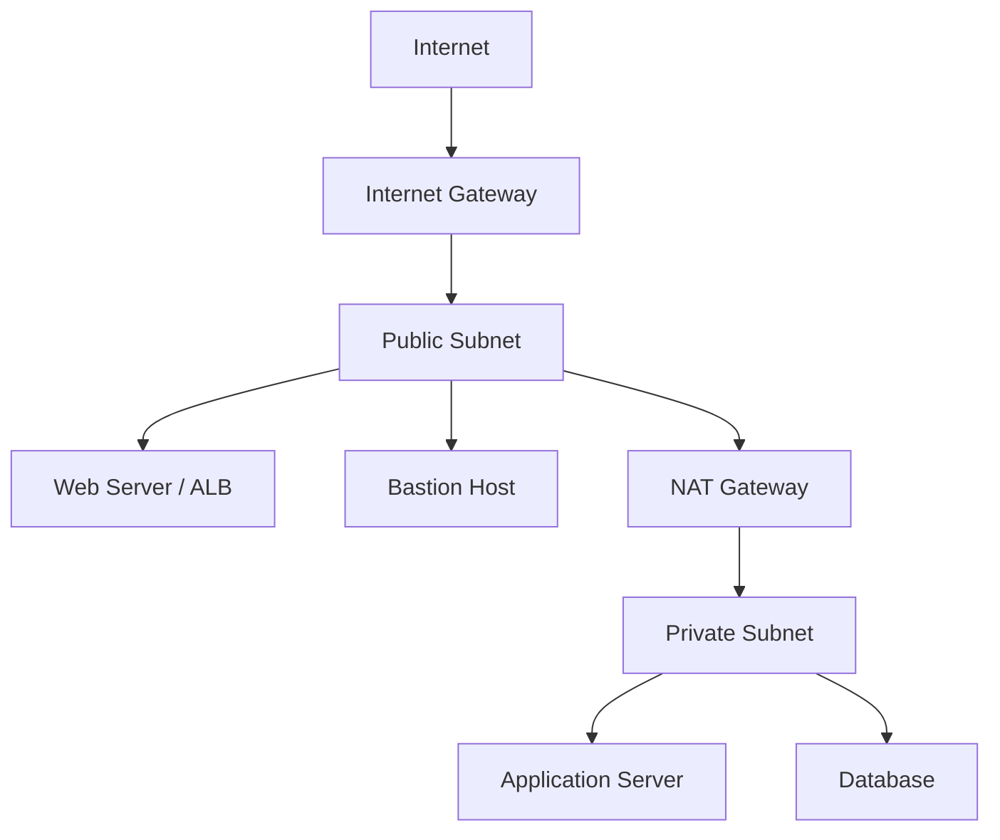
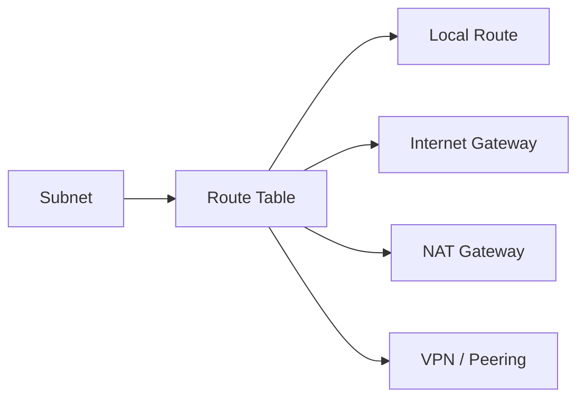

# 🌐 VPC, Subnetting, and Networking

## 🧠 What is a VPC?
A Virtual Private Cloud (VPC) is an isolated private network inside AWS where you can launch your resources such as EC2 instances, RDS databases, load balancers, and private services. It gives you full control over your network environment inside the AWS cloud.

A VPC is important because it allows you to design a secure and structured network architecture without needing to maintain physical networking hardware. In AWS, a VPC acts as the foundation for most cloud networking designs.

### 🧩 Why VPC matters
A VPC helps you:
- isolate workloads logically
- control IP addressing and routing
- implement security boundaries
- connect workloads securely to the internet or on-premises networks
- build enterprise-grade architectures with multiple layers of protection

### 🏗️ VPC architecture overview


---

## 🏗️ VPC Core Components

### 1. 🧱 VPC
The VPC is the main network boundary for your AWS resources. It defines the overall IP address range for the network and acts as the container for all subnets, route tables, gateways, and security controls.

A VPC is created with a CIDR block such as:
- 10.0.0.0/16
- 172.31.0.0/16
- 192.168.1.0/24

### 2. 🧩 Subnets
A subnet is a segment of the VPC IP range. Subnets divide the VPC into smaller network zones that can be used for different purposes.

Common subnet types:
- Public subnet: has a route to an Internet Gateway
- Private subnet: does not have direct internet access
- Database subnet: used for databases and internal services

### 3. 🧭 Route Tables
Route tables define how traffic flows from subnets to destinations such as the internet, other subnets, or VPN connections.

Examples:
- local route: traffic inside the VPC
- 0.0.0.0/0 route: internet-bound traffic
- custom routes: traffic to peered VPCs or on-premises networks

### 4. 🌐 Internet Gateway (IGW)
An Internet Gateway allows resources in a public subnet to communicate with the internet.

It is used when:
- a web server must be reachable from the internet
- a load balancer needs public traffic
- a bastion host is exposed for administration

### 5. 🔄 NAT Gateway
A NAT Gateway allows instances in private subnets to access the internet for updates, package downloads, and outbound traffic without exposing them directly to the public internet.

Important point:
- NAT Gateway is for outbound-only traffic in most cases
- it does not make private resources directly reachable from the internet

### 6. 🔐 Security Groups
Security Groups act as virtual firewalls for individual EC2 instances or other resources.

They are:
- stateful
- attached to instances or ENIs
- used to allow or restrict inbound and outbound traffic

### 7. 🚧 Network ACLs (NACLs)
Network ACLs are stateless firewalls that operate at the subnet level.

They:
- evaluate traffic before it enters or leaves a subnet
- are rule-based and can allow or deny traffic
- provide a broader layer of protection than Security Groups

---

## 🧩 Public vs Private Subnets

### 🌐 Public Subnet
A public subnet is used for resources that must be reachable from the internet, such as:
- web servers
- load balancers
- bastion hosts

These subnets usually have a route to an Internet Gateway.

### 🔒 Private Subnet
A private subnet is used for internal resources that should not be directly exposed to the internet, such as:
- application servers
- databases
- internal services

These resources often use NAT Gateway for outbound internet access.

### 🧠 Practical difference
- Public subnet = internet-facing resources
- Private subnet = internal-only resources

---

## 🔢 CIDR and IP Planning
CIDR blocks define the IP address range of a VPC or subnet.

Examples:
- 10.0.0.0/16
- 172.31.0.0/16
- 192.168.1.0/24

### Important points
- The VPC CIDR must be large enough for future growth
- Subnets must not overlap with each other
- Careful IP planning avoids routing issues later
- You should reserve space for future subnets and services

### 🧮 CIDR basics
A smaller suffix means a larger network:
- /16 = 65,536 IP addresses
- /24 = 256 IP addresses

This is why a VPC is often created with a large block like /16 and subnets are divided into /24s.

---

## 🗺️ VPC Networking Diagram
```text
Internet
   │
   ▼
 Internet Gateway
   │
   ▼
   VPC
 ┌───────────────────┬───────────────────┐
 │ Public Subnet     │ Private Subnet    │
 │ Web / ALB / Bastion│ App / DB / Cache │
 └───────────────────┴───────────────────┘
        │                        │
        │                        └── NAT Gateway --> Internet
        └── Route Table --> Internet Gateway
```

This diagram shows the common pattern where public resources communicate with the internet while private resources stay internal and use NAT for outbound traffic.

---

## 🔁 Routing and Traffic Flow
Route tables determine where traffic is sent.

### Common routes
- local route: traffic within the VPC
- default route 0.0.0.0/0: traffic to the internet
- custom routes: traffic to peered VPCs, VPNs, or on-premises networks

### Example flow
1. A user sends a request to a web server in a public subnet.
2. The request passes through the Internet Gateway.
3. The web server responds.
4. An application server in a private subnet reaches the internet only through NAT Gateway.

### 🔄 Route table example


---

## 🔐 Security in VPC
Security inside a VPC is managed using several layers.

### Security Groups
- attached to instances
- stateful
- allow or deny traffic based on rules
- evaluated at the instance level

### Network ACLs
- attached to subnets
- stateless
- evaluated as a list of allow/deny rules
- provide subnet-level filtering

### Key difference
- Security Groups are instance-level protection
- NACLs provide subnet-level protection

A common design is:
- Security Groups for application-level traffic control
- NACLs for broader subnet-level filtering

### 🧠 Important note
Security Groups are often the first layer of defense. NACLs are usually used as a second layer for more general control.

---

## 🔗 VPC Connectivity Options
AWS offers different ways to connect VPCs and external networks.

### VPC Peering
Used to connect two VPCs privately.

### VPN Connection
Used to connect an on-premises network to AWS over a secure tunnel.

### AWS Direct Connect
Provides a dedicated network connection from on-premises to AWS.

### Gateway Endpoint / Interface Endpoint
Used to access AWS services privately without sending traffic over the public internet.

### 🧩 When to use which
- VPC Peering: connect two VPCs
- VPN: connect to corporate networks
- Direct Connect: high-performance private connectivity
- Endpoints: securely access AWS services without internet exposure

---

## 📈 VPC Design Patterns
Common patterns used in real-world AWS architectures include:

### 1. Two-tier architecture
- web tier in public subnet
- database tier in private subnet

### 2. Three-tier architecture
- web tier in public subnet
- application tier in private subnet
- database tier in private subnet

### 3. Hybrid architecture
- AWS resources in VPC
- connections to on-premises data centers using VPN or Direct Connect

---

## ✅ Best Practices
- Place web-facing resources in public subnets
- Keep databases and internal services in private subnets
- Use NAT Gateway for private instances that need outbound internet access
- Restrict access with Security Groups and NACLs
- Use careful CIDR planning to avoid overlapping ranges
- Monitor flow logs for troubleshooting and security analysis
- Use separate subnets for different tiers such as web, app, and database
- Tag resources properly for environment and ownership

---

## 📝 Exam Notes
- A VPC is an isolated virtual network inside AWS.
- Public subnets have internet access; private subnets do not.
- Security Groups are stateful and instance-level.
- NACLs are stateless and subnet-level.
- NAT Gateway enables private subnets to reach the internet securely.
- CIDR planning is important for network design and future scalability.
- Route tables control how traffic leaves and enters subnets.

---

## 🧪 Practical Part

## 1. 🛠️ Manual Labs for VPC and Networking
These steps are written as a classroom-style walkthrough. Students should follow them in order and not skip any step.

### Lab 1: Create a VPC manually
1. Sign in to the AWS Management Console.
2. Search for VPC in the services search bar.
3. In the VPC Dashboard, click Create VPC.
4. Choose VPC only.
5. Enter a name tag such as demo-vpc.
6. Set the IPv4 CIDR block to 10.0.0.0/16.
7. Leave the tenancy as Default.
8. Click Create VPC.
9. Wait for the creation to finish and confirm that the VPC appears in the list.
10. Write down the VPC ID because you will use it later.

Expected result: a new VPC exists with the CIDR block 10.0.0.0/16.

### Lab 2: Create a public subnet
1. In the left menu, click Subnets.
2. Click Create subnet.
3. Select your newly created VPC.
4. Choose an Availability Zone such as us-east-1a.
5. Enter the subnet name as public-subnet-1.
6. Set the CIDR block to 10.0.1.0/24.
7. Enable Auto-assign public IPv4 address.
8. Click Create subnet.
9. Confirm that the subnet appears in the list.

Expected result: a public subnet is created and can receive public IPs.

### Lab 3: Create a private subnet
1. Click Create subnet again.
2. Select the same VPC.
3. Choose a different Availability Zone such as us-east-1b.
4. Name it private-subnet-1.
5. Set the CIDR block to 10.0.2.0/24.
6. Do not enable Auto-assign public IPv4 address.
7. Click Create subnet.
8. Confirm that it appears in the list.

Expected result: a private subnet exists for internal resources.

### Lab 4: Create an Internet Gateway
1. In the left menu, click Internet Gateways.
2. Click Create internet gateway.
3. Give it a name such as demo-igw.
4. Click Create internet gateway.
5. Click Attach to VPC.
6. Select your VPC and click Attach internet gateway.

Expected result: the Internet Gateway is attached to the VPC.

### Lab 5: Create a route table for the public subnet
1. Go to Route Tables.
2. Click Create route table.
3. Select your VPC.
4. Name it public-route-table.
5. Click Create route table.
6. Select the new route table.
7. Open Routes.
8. Click Edit routes.
9. Click Add route.
10. Set Destination to 0.0.0.0/0.
11. Set Target to the Internet Gateway you created.
12. Save the changes.
13. Go to Subnet associations.
14. Click Edit subnet associations.
15. Select the public subnet and save.

Expected result: traffic from the public subnet can leave the VPC and reach the internet.

### Lab 6: Create a NAT Gateway
1. Go to NAT Gateways.
2. Click Create NAT gateway.
3. Choose the public subnet.
4. Allocate an Elastic IP address.
5. Click Create NAT gateway.
6. Wait until the status changes to Available.
7. Go to Route Tables.
8. Create a new route table named private-route-table.
9. Add a route with Destination 0.0.0.0/0 and Target the NAT Gateway.
10. Associate this route table with the private subnet.

Expected result: instances in the private subnet can reach the internet for outbound traffic only.

### Lab 7: Create Security Groups
1. Go to Security Groups.
2. Click Create security group.
3. Name it web-sg.
4. Select your VPC.
5. Add an inbound rule for SSH from your IP address.
6. Add an inbound rule for HTTP from 0.0.0.0/0.
7. Add an outbound rule allowing all traffic.
8. Click Create security group.

Expected result: the security group allows web and SSH access to the instance.

### Lab 8: Create a Network ACL
1. Go to Network ACLs.
2. Click Create network ACL.
3. Select your VPC.
4. Name it demo-nacl.
5. Click Create.
6. Select the NACL and open Inbound rules.
7. Add a rule allowing SSH and HTTP traffic.
8. Associate the NACL with the public subnet.

Expected result: the subnet has a basic network-level access control list.

### Lab 9: Launch EC2 instances in both subnets
1. Go to EC2.
2. Click Launch instance.
3. Choose Amazon Linux or Ubuntu.
4. Select the instance type such as t3.micro.
5. Create or select a key pair.
6. In Network settings, choose your VPC.
7. Select the public subnet for the first instance.
8. Select the private subnet for the second instance.
9. Assign the web security group to both instances.
10. Launch the instances.
11. Wait until both instances show running.

Expected result: one instance is internet-facing and another is internal-only.

### Lab 10: Test connectivity and confirm behavior
1. Use SSH to connect to the public instance.
2. Try to ping or connect to the private instance using its private IP.
3. Confirm that the private instance can reach the internet through NAT for outbound traffic.
4. Confirm that the private instance is not directly exposed to the internet.
5. Record your observations in a notebook or notes file.

Common mistakes to avoid:
- forgetting to associate the route table with the subnet
- attaching the Internet Gateway without creating the route
- using the same CIDR block in multiple subnets
- forgetting to allocate an Elastic IP for NAT Gateway

### Student checklist
- VPC created
- Public and private subnets created
- Internet Gateway attached
- Public route table configured
- NAT Gateway created
- Security Group created
- NACL created
- EC2 instances launched in both subnets
- Internet and private access behavior tested
---

## 2. 🧱 Using Terraform to Provision VPC and Networking
The following Terraform example provisions:
- a VPC
- public and private subnets
- an Internet Gateway
- a NAT Gateway
- route tables
- security groups

### Step 1: Create a Terraform file
Create a file named main.tf with the following content:

```hcl
terraform {
  required_providers {
    aws = {
      source  = "hashicorp/aws"
      version = "~> 5.0"
    }
  }
}

provider "aws" {
  region = "us-east-1"
}

resource "aws_vpc" "main" {
  cidr_block = "10.0.0.0/16"
  tags = {
    Name = "demo-vpc"
  }
}

resource "aws_subnet" "public" {
  vpc_id                  = aws_vpc.main.id
  cidr_block              = "10.0.1.0/24"
  availability_zone       = "us-east-1a"
  map_public_ip_on_launch = true

  tags = {
    Name = "public-subnet"
  }
}

resource "aws_subnet" "private" {
  vpc_id            = aws_vpc.main.id
  cidr_block        = "10.0.2.0/24"
  availability_zone = "us-east-1b"

  tags = {
    Name = "private-subnet"
  }
}

resource "aws_internet_gateway" "igw" {
  vpc_id = aws_vpc.main.id
}

resource "aws_route_table" "public" {
  vpc_id = aws_vpc.main.id

  route {
    cidr_block = "0.0.0.0/0"
    gateway_id = aws_internet_gateway.igw.id
  }
}

resource "aws_route_table_association" "public" {
  subnet_id      = aws_subnet.public.id
  route_table_id = aws_route_table.public.id
}

resource "aws_eip" "nat" {
  domain = "vpc"
}

resource "aws_nat_gateway" "nat" {
  allocation_id = aws_eip.nat.id
  subnet_id     = aws_subnet.public.id
}

resource "aws_route_table" "private" {
  vpc_id = aws_vpc.main.id

  route {
    cidr_block     = "0.0.0.0/0"
    nat_gateway_id = aws_nat_gateway.nat.id
  }
}

resource "aws_route_table_association" "private" {
  subnet_id      = aws_subnet.private.id
  route_table_id = aws_route_table.private.id
}

resource "aws_security_group" "web" {
  name        = "web-sg"
  description = "Allow SSH and HTTP"
  vpc_id      = aws_vpc.main.id

  ingress {
    from_port   = 22
    to_port     = 22
    protocol    = "tcp"
    cidr_blocks = ["0.0.0.0/0"]
  }

  ingress {
    from_port   = 80
    to_port     = 80
    protocol    = "tcp"
    cidr_blocks = ["0.0.0.0/0"]
  }

  egress {
    from_port   = 0
    to_port     = 0
    protocol    = "-1"
    cidr_blocks = ["0.0.0.0/0"]
  }
}
```

### Step 2: Initialize and apply Terraform
```bash
terraform init
terraform plan
terraform apply -auto-approve
```

### Step 3: Verify the resources
After deployment:
- check the VPC, subnets, and route tables in the AWS console
- verify the Internet Gateway and NAT Gateway status
- inspect the Security Group rules

### Step 4: Destroy the resources when done
```bash
terraform destroy -auto-approve
```

---

## ✅ Summary
VPCs are the backbone of AWS networking. A well-designed VPC helps you secure resources, manage traffic, and build scalable cloud architectures. Understanding subnets, route tables, gateways, and security layers is essential for real-world AWS solutions.

