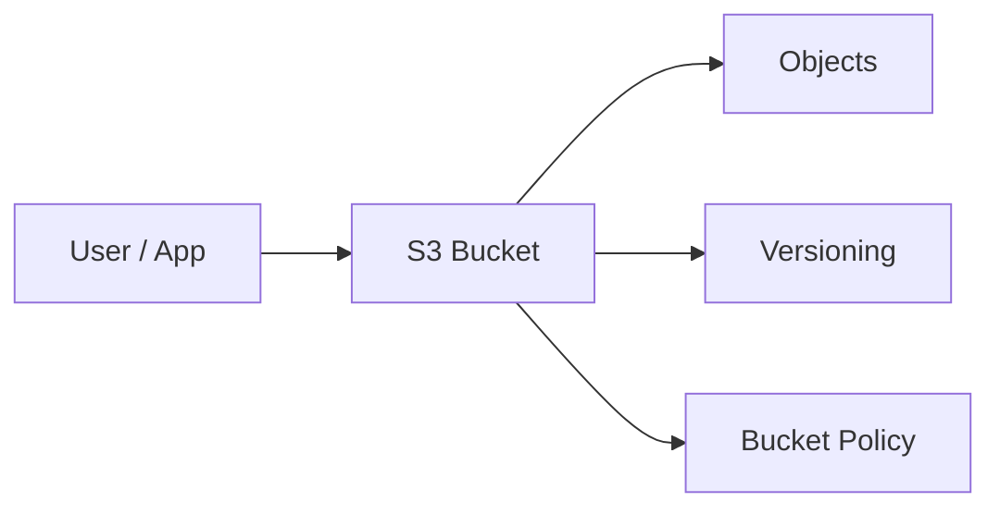

# 🗄️ S3 and Storage Classes

## 🧠 What is S3?
Amazon S3 is AWS’s object storage service used for storing files, backups, logs, media, and static web content. It is designed for durability, scalability, and high availability.

### 🧩 Core idea
S3 stores data as objects, not as files in a traditional filesystem. Each object has:
- data
- metadata
- a key (path-like identifier)

### 🏗️ S3 architecture view


---

## 🧱 Core S3 Concepts

### Bucket
A bucket is the top-level container for objects.

### Object
An object is the actual file and its metadata.

### Versioning
Versioning keeps multiple versions of an object so you can recover older copies.

### Lifecycle Rules
Lifecycle rules automatically move or expire objects based on age.

### Encryption
S3 supports server-side encryption and client-side encryption.

### Access Control
Bucket policies, ACLs, and IAM policies control who can access the data.

---

## 📦 Common Storage Classes

### S3 Standard
For frequently accessed data.

### S3 Intelligent-Tiering
Automatically moves data between access tiers based on usage patterns.

### S3 Standard-IA
For infrequently accessed data that still needs rapid access.

### S3 One Zone-IA
Lower-cost option stored in a single Availability Zone.

### S3 Glacier and Glacier Deep Archive
Used for long-term archival with slower retrieval times.

---

## 🧠 When to use S3
- static website hosting
- backup and disaster recovery
- media storage
- analytics and data lake storage
- log archives

---

## ✅ Best Practices
- enable versioning
- enable default encryption
- use lifecycle policies to reduce cost
- use bucket policies and IAM carefully
- block public access unless explicitly needed
- enable monitoring and logging

---

## 🧪 Practical Part

### 1. 🛠️ Manual labs
These steps are written to guide students through S3 from start to finish.

#### Lab 1: Create an S3 bucket
1. Sign in to the AWS console.
2. Open S3.
3. Click Create bucket.
4. Enter a globally unique bucket name.
5. Choose the region.
6. Keep the default settings for now.
7. Click Create bucket.
8. Confirm the bucket appears in the list.

Expected result: an S3 bucket is created.

#### Lab 2: Upload an object to the bucket
1. Open the newly created bucket.
2. Click Upload.
3. Add a sample file such as a text file or image.
4. Click Upload.
5. Wait for the upload to finish.
6. Click the uploaded object and review its properties.

Expected result: the object is stored successfully in S3.

#### Lab 3: Enable versioning
1. Open the bucket properties.
2. Find Versioning.
3. Click Edit.
4. Enable versioning.
5. Save the changes.
6. Upload the same file again with a changed content.
7. Observe that a new version is created.

Expected result: old versions are retained.

#### Lab 4: Create a lifecycle rule
1. Go to the Management tab for the bucket.
2. Click Create lifecycle rule.
3. Name the rule such as archive-old-objects.
4. Choose to apply to all objects.
5. Add a transition to Glacier after 30 days.
6. Create the rule.

Expected result: objects are moved to a cheaper storage class over time.

#### Lab 5: Enable default encryption
1. Open the bucket properties.
2. Find Default encryption.
3. Enable SSE-S3.
4. Save the configuration.

Expected result: uploaded objects are encrypted automatically.

#### Lab 6: Host a static website
1. Upload an index.html file and an error page.
2. Open the Properties tab.
3. Under Static website hosting, enable hosting.
4. Set the index document to index.html.
5. Save the configuration.
6. Open the generated endpoint in a browser.

Expected result: the bucket hosts a simple website.

### Student checklist
- Bucket created
- Object uploaded
- Versioning enabled
- Lifecycle rule created
- Encryption enabled
- Static website hosted
### 2. 🧱 Terraform example
```hcl
terraform {
  required_providers {
    aws = {
      source  = "hashicorp/aws"
      version = "~> 5.0"
    }
  }
}

provider "aws" {
  region = "us-east-1"
}

resource "aws_s3_bucket" "demo" {
  bucket = "demo-bucket-12345678"
}

resource "aws_s3_bucket_versioning" "demo" {
  bucket = aws_s3_bucket.demo.id
  versioning_configuration {
    status = "Enabled"
  }
}

resource "aws_s3_bucket_server_side_encryption_configuration" "demo" {
  bucket = aws_s3_bucket.demo.id

  rule {
    apply_server_side_encryption_by_default {
      sse_algorithm = "AES256"
    }
  }
}
```

---

## 📝 Exam Notes
- S3 is designed for durability and high availability.
- Use lifecycle policies to reduce storage cost over time.
- S3 is object storage, not block storage.
