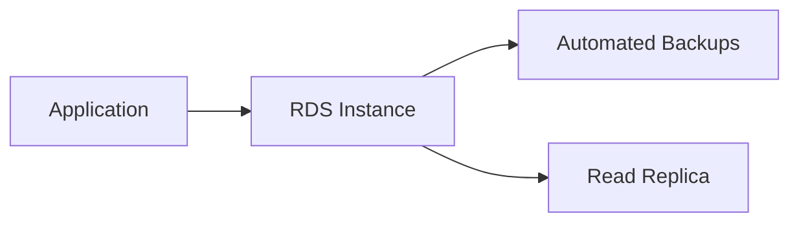
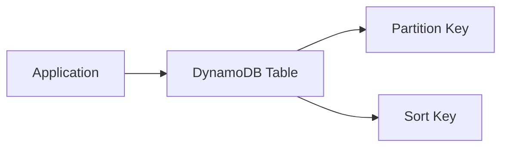

# 🗃️ RDS and DynamoDB

## 🧠 What is Amazon RDS?
Amazon RDS is a managed relational database service that supports MySQL, PostgreSQL, SQL Server, Oracle, and MariaDB. It removes much of the operational burden of running databases yourself.

### 🧩 RDS architecture view


---

## 🧱 RDS Features
- Multi-AZ deployment for high availability
- Read Replicas for scaling reads
- Automated backups and snapshots
- Easy patching and maintenance
- Monitoring and performance insights

### When RDS is a good fit
Use RDS for:
- transactional workloads
- applications needing SQL joins
- structured data with strong consistency needs

---

## 🧠 What is Amazon DynamoDB?
Amazon DynamoDB is a fully managed, serverless NoSQL database designed for high throughput and low-latency access. It is ideal for modern applications that need fast and flexible data access.

### 🧩 DynamoDB architecture view


---

## 🧱 DynamoDB Basics
- Tables store items
- Partition key and sort key define the data model
- Strong consistency and eventual consistency are important concepts
- DynamoDB scales horizontally very well

### When DynamoDB is a good fit
Use DynamoDB for:
- key-value and document workloads
- high-scale applications
- session stores and real-time use cases

---

## ⚖️ RDS vs DynamoDB
- Use RDS for relational data and complex joins
- Use DynamoDB for flexible key-value and document workloads
- RDS is more traditional and SQL-oriented
- DynamoDB is more modern and highly scalable

---

## 🧪 Practical Part

### 1. 🛠️ Manual labs
1. Create an RDS instance in the AWS console.
2. Choose a database engine such as PostgreSQL.
3. Configure credentials, storage, and networking.
4. Connect to the database using a client.
5. Create a DynamoDB table and add sample items.
6. Test read and write operations.

### 2. 🧱 Terraform example
```hcl
terraform {
  required_providers {
    aws = {
      source  = "hashicorp/aws"
      version = "~> 5.0"
    }
  }
}

provider "aws" {
  region = "us-east-1"
}

resource "aws_db_instance" "example" {
  allocated_storage    = 20
  engine               = "postgres"
  engine_version       = "16.3"
  instance_class       = "db.t3.micro"
  db_name              = "exampledb"
  username             = "postgres"
  password             = "YourStrongPassword123!"
  skip_final_snapshot  = true
}

resource "aws_dynamodb_table" "example" {
  name         = "example-table"
  billing_mode = "PAY_PER_REQUEST"
  hash_key     = "id"

  attribute {
    name = "id"
    type = "S"
  }
}
```

---

## 📝 Exam Notes
- RDS is suitable for transactional applications.
- DynamoDB is often preferred for high-scale modern applications.
- Choose based on data model, workload type, and operational needs.
