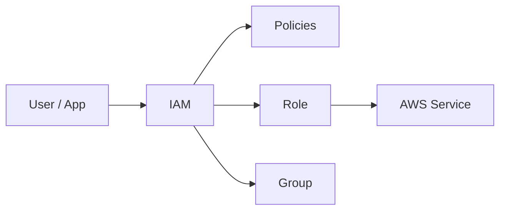

# 🔐 IAM and Access Control

## 🧠 What is IAM?
AWS Identity and Access Management (IAM) is the service used to control who can access AWS resources and what actions they can perform. It is the foundation of AWS security because it governs authentication and authorization.

### 🔑 Key idea
- Authentication confirms identity
- Authorization defines what actions are allowed

### 🧩 IAM architecture view


---

## 🧱 Core IAM Components

### 1. Users
Users represent human identities or service accounts. They can have permissions directly attached or be placed in groups.

### 2. Groups
Groups are collections of users. They simplify permission management because you can assign policies to the group instead of each user individually.

### 3. Roles
Roles are used to grant temporary permissions to users, applications, or AWS services. They are preferred over embedding long-term credentials in applications.

### 4. Policies
Policies are JSON documents that grant or deny permissions. They can be attached to users, groups, or roles.

### 5. Identity Federation
Federation allows external identities such as Azure AD, Google, or corporate SAML providers to access AWS without creating separate IAM users.

---

## 🛡️ IAM Security Concepts

### Principle of least privilege
Grant only the minimum permissions required to complete a task.

### Multi-Factor Authentication (MFA)
MFA adds an extra layer of protection to privileged accounts.

### Permission boundaries
These limit the maximum permissions an IAM entity can have.

### Service-linked roles
AWS services create these roles automatically to perform actions on your behalf.

### Access Analyzer
This helps identify resources that are shared with external principals unexpectedly.

---

## ✅ IAM Best Practices
- follow the principle of least privilege
- use roles instead of long-lived access keys for applications
- enable MFA for privileged accounts
- rotate credentials regularly
- avoid sharing root user credentials
- use policies and groups to keep access management organized
- monitor access with CloudTrail and IAM Access Analyzer

---

## 📌 IAM vs Other Security Services
- IAM manages identities and permissions
- KMS manages encryption keys
- Security Groups control network traffic
- CloudTrail records API activity

---

## 🧪 Practical Part

### 1. 🛠️ Manual labs
These steps are written so students can follow them exactly and learn IAM by doing.

#### Lab 1: Create an IAM user
1. Sign in to the AWS console with an admin account.
2. Open IAM.
3. In the left menu, click Users.
4. Click Add users.
5. Enter a username such as demo-user.
6. Choose Access key - Programmatic access if you want CLI access.
7. Click Next.
8. Select Add user to group or attach policies directly.
9. Create a group named developers if needed.
10. Attach a basic policy such as AmazonS3ReadOnlyAccess.
11. Click Next and then Create user.
12. Save the access key and secret key securely.

Expected result: a new IAM user exists with restricted permissions.

#### Lab 2: Attach a custom policy
1. Go to Policies in IAM.
2. Click Create policy.
3. Use the JSON editor.
4. Add an S3 read-only permission.
5. Name the policy s3-read-only-demo.
6. Attach it to the demo user or group.
7. Test the permission by trying to list S3 buckets.

Expected result: the user can read S3 data but cannot make changes.

#### Lab 3: Create a group and add users
1. Go to Groups in IAM.
2. Click Create group.
3. Name it developers.
4. Attach a policy such as AmazonEC2ReadOnlyAccess.
5. Add the demo user to the group.
6. Confirm the user inherits the group policy.

Expected result: permissions are managed centrally through the group.

#### Lab 4: Create an IAM role for EC2
1. Open IAM and go to Roles.
2. Click Create role.
3. Choose AWS service and then EC2.
4. Attach a policy that allows reading from S3.
5. Name the role ec2-s3-read-role.
6. Create the role.
7. Later, attach the role to an EC2 instance in the EC2 console.

Expected result: the EC2 instance can access AWS services without hardcoded credentials.

#### Lab 5: Enable MFA for a user
1. Go to Users.
2. Select a user.
3. Open the Security credentials tab.
4. Click Assign MFA device.
5. Choose Virtual MFA device.
6. Follow the QR code and verification steps.
7. Complete the setup.

Expected result: MFA is enabled and adds an extra security layer.

#### Lab 6: Review policy access using the IAM simulator
1. Open IAM.
2. Go to Policy simulator.
3. Select the user or role.
4. Test a simple action such as s3:ListBucket.
5. Review whether access is allowed or denied.

Expected result: students learn how IAM permissions are evaluated.

### Student checklist
- IAM user created
- Group created
- Policy attached
- Role created
- MFA enabled
- Permissions tested
### 2. 🧱 Terraform example
```hcl
terraform {
  required_providers {
    aws = {
      source  = "hashicorp/aws"
      version = "~> 5.0"
    }
  }
}

provider "aws" {
  region = "us-east-1"
}

resource "aws_iam_user" "demo" {
  name = "demo-user"
}

resource "aws_iam_policy" "s3_read" {
  name = "s3-read-policy"
  policy = jsonencode({
    Version = "2012-10-17"
    Statement = [{
      Effect = "Allow"
      Action = ["s3:GetObject", "s3:ListBucket"]
      Resource = ["*"]
    }]
  })
}

resource "aws_iam_user_policy_attachment" "attach" {
  user       = aws_iam_user.demo.name
  policy_arn = aws_iam_policy.s3_read.arn
}
```

---

## 📝 Exam Notes
- Roles are preferred over embedding credentials in applications.
- IAM controls access at the identity layer.
- Least privilege is a core AWS security principle.

