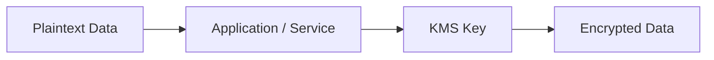

# 🛡️ KMS and Encryption

## 🧠 What is KMS?
AWS Key Management Service (KMS) is used to create, manage, and rotate encryption keys. It helps organizations protect data confidentiality and meet compliance requirements.

### 🔐 Why encryption matters
Encryption protects data from unauthorized access and is essential when handling sensitive information such as customer records, payment data, and secrets.

### 🧩 Encryption flow


---

## 🔐 Encryption Options

### 1. Server-side encryption
AWS encrypts data at rest for you before storing it.

### 2. Client-side encryption
The application encrypts the data before sending it to AWS.

### 3. Envelope encryption
A data key is encrypted by a master key. This is a common security pattern in cloud systems.

---

## 🧱 Key Management Concepts

### Customer Managed Keys (CMKs)
These are keys created and managed by the customer.

### AWS-managed keys
AWS creates and manages these for some services automatically.

### Key policies
These define who can use and manage a KMS key.

### Key aliases
Aliases provide friendly names for KMS keys.

### Automatic key rotation
This helps improve security by rotating keys over time.

---

## ☁️ AWS Services Using KMS
- S3
- EBS
- RDS
- Redshift
- Secrets Manager
- EFS

---

## ✅ Best Practices
- use encryption by default
- store keys separately from encrypted data
- restrict key access with least privilege
- rotate keys regularly
- use CMKs when you need full control

---

## 🧪 Practical Part

### 1. 🛠️ Manual labs
1. Open the KMS console.
2. Create a customer-managed key.
3. Add an alias and configure a key policy.
4. Encrypt a sample file using the AWS console or CLI.
5. Decrypt it and verify the output.

### 2. 🧱 Terraform example
```hcl
terraform {
  required_providers {
    aws = {
      source  = "hashicorp/aws"
      version = "~> 5.0"
    }
  }
}

provider "aws" {
  region = "us-east-1"
}

resource "aws_kms_key" "demo" {
  description             = "demo key"
  deletion_window_in_days = 10
}

resource "aws_kms_alias" "demo" {
  name          = "alias/demo-key"
  target_key_id = aws_kms_key.demo.key_id
}
```

---

## 📝 Exam Notes
- Encryption protects data confidentiality and supports compliance requirements.
- KMS is often used for central key management across multiple AWS services.
- Managed keys are easier, but CMKs offer more control.
