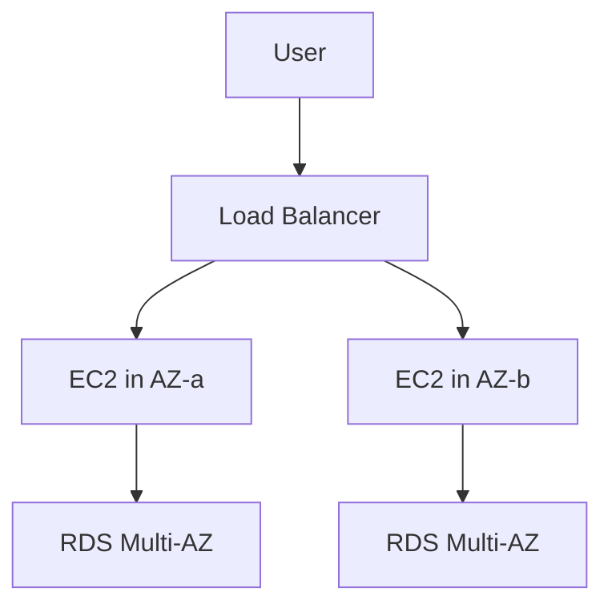

# ♻️ High Availability and Disaster Recovery

## 🧠 Core Concepts
- High Availability (HA): reduce downtime and keep services available
- Fault Tolerance: continue working even if a component fails
- Disaster Recovery (DR): recover from a major outage or regional failure
- RPO: how much data loss is acceptable
- RTO: how quickly recovery must happen

### 🧩 Architecture view


---

## 🏗️ AWS Resilience Patterns
- Multi-AZ deployment for databases and critical services
- Cross-region replication for backup and recovery readiness
- Load balancing across multiple instances
- Auto Scaling to handle traffic bursts
- Backups, snapshots, and recovery orchestration

---

## 🧭 DR Strategies

### 1. Backup and Restore
The simplest strategy where backups are restored when needed.

### 2. Pilot Light
A minimal environment remains running in another region so recovery is faster.

### 3. Warm Standby
A scaled-down but ready environment exists in another region.

### 4. Multi-Site Active/Active
Two or more full environments run simultaneously for maximum availability.

---

## ✅ Best Practices
- design for failure
- use Multi-AZ for critical components
- test recovery plans regularly
- define RTO and RPO clearly
- use automation for failover and backup recovery

---

## 🧪 Practical Part

### 1. 🛠️ Manual labs
1. Create an EC2 instance in one Availability Zone.
2. Launch a second instance in another AZ.
3. Configure a load balancer across both instances.
4. Enable Multi-AZ for an RDS database.
5. Create a backup and simulate recovery.

### 2. 🧱 Terraform example
```hcl
terraform {
  required_providers {
    aws = {
      source  = "hashicorp/aws"
      version = "~> 5.0"
    }
  }
}

provider "aws" {
  region = "us-east-1"
}

resource "aws_db_instance" "example" {
  identifier              = "example-db"
  allocated_storage       = 20
  engine                  = "postgres"
  engine_version          = "16.3"
  instance_class          = "db.t3.micro"
  username                = "postgres"
  password                = "YourStrongPassword123!"
  multi_az                = true
  skip_final_snapshot     = true
}
```

---

## 📝 Exam Notes
- Multi-AZ improves availability, not necessarily disaster recovery alone.
- Cross-region design is important for true DR planning.
- HA and DR are different: HA reduces downtime; DR focuses on recovery from major events.
