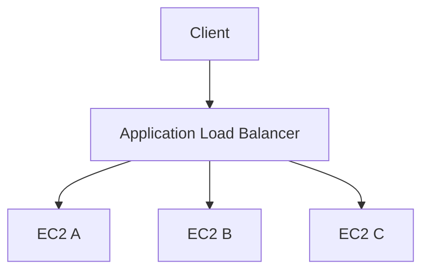

# ⚖️ Load Balancing and Auto Scaling

## 🧠 What is a load balancer?
A load balancer distributes incoming traffic across multiple targets such as EC2 instances, containers, or IP addresses. It improves availability, fault tolerance, and application performance.

### 🧩 Architecture view


---

## 🧱 Load Balancer Types

### Application Load Balancer (ALB)
Best for HTTP and HTTPS applications.

### Network Load Balancer (NLB)
Best for TCP/UDP and very high-performance workloads.

### Classic Load Balancer
Older option and mostly legacy use.

---

## 🔧 Key Concepts
- Target Groups define the backend instances or containers that receive traffic
- Health Checks monitor service health and remove unhealthy targets
- Path-based routing and host-based routing are common ALB features

---

## 📈 Auto Scaling Groups
Auto Scaling Groups help maintain the desired number of instances based on demand or health status.

### Scaling policies
- Simple scaling
- Step scaling
- Target tracking scaling

---

## ✅ Best Practices
- place instances in multiple AZs
- use health checks
- combine load balancing with Auto Scaling
- use target groups for better traffic control

---

## 🧪 Practical Part

### 1. 🛠️ Manual labs
1. Create two EC2 instances.
2. Create a target group and register both instances.
3. Create an Application Load Balancer.
4. Configure listener rules and health checks.
5. Create an Auto Scaling Group and test scaling.

### 2. 🧱 Terraform example
```hcl
terraform {
  required_providers {
    aws = {
      source  = "hashicorp/aws"
      version = "~> 5.0"
    }
  }
}

provider "aws" {
  region = "us-east-1"
}

resource "aws_launch_template" "example" {
  name_prefix   = "example-lt-"
  image_id      = "ami-0c02fb55956c7d316"
  instance_type = "t3.micro"
}

resource "aws_autoscaling_group" "example" {
  desired_capacity    = 2
  max_size            = 4
  min_size            = 2
  vpc_zone_identifier = ["subnet-12345678"]

  launch_template {
    id      = aws_launch_template.example.id
    version = "$Latest"
  }
}
```

---

## 📝 Exam Notes
- ALB works at Layer 7; NLB works at Layer 4.
- Auto Scaling improves availability and cost efficiency.
