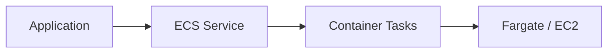
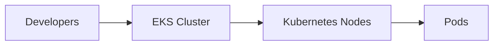

# 🐳 ECS, EKS, and Lambda

## 🧠 What is Amazon ECS?
Amazon ECS is AWS’s fully managed container orchestration service for running Docker containers. It is often a good fit for teams that want container-based workloads without operating Kubernetes.

### 🧩 ECS architecture view


---

## 🧠 What is Amazon EKS?
Amazon EKS is AWS’s managed Kubernetes service for running Kubernetes-based applications. It is commonly used by teams that already rely on Kubernetes tooling and workflows.

### 🧩 EKS architecture view


---

## 🧠 What is AWS Lambda?
AWS Lambda runs code in response to events without requiring you to manage servers. It is a core serverless service in AWS.

---

## ⚖️ When to use what
- ECS: simpler container workloads in AWS
- EKS: teams already using Kubernetes
- Lambda: event-driven and short-lived workloads

---

## ✅ Common patterns
- Fargate for serverless containers
- Lambda with API Gateway for APIs
- EKS for large-scale container platforms

---

## 🧪 Practical Part

### 1. 🛠️ Manual labs
1. Create an ECS cluster in the AWS console.
2. Define a task definition and run a sample container.
3. Create an EKS cluster and deploy a sample workload.
4. Create a Lambda function and trigger it with an S3 event.

### 2. 🧱 Terraform example
```hcl
terraform {
  required_providers {
    aws = {
      source  = "hashicorp/aws"
      version = "~> 5.0"
    }
  }
}

provider "aws" {
  region = "us-east-1"
}

resource "aws_lambda_function" "example" {
  filename         = "function.zip"
  function_name    = "example-function"
  role             = "arn:aws:iam::123456789012:role/lambda-role"
  handler          = "index.handler"
  runtime          = "python3.11"
}
```

---

## 📝 Exam Notes
- Lambda is serverless compute; ECS and EKS are container orchestration services.
- Choose based on operational model, portability, and workload shape.
