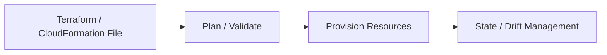

# ⚙️ CloudFormation and Terraform

## 🧠 What is Infrastructure as Code?
Infrastructure as Code (IaC) allows teams to provision and manage AWS resources using declarative files instead of manual steps. This improves consistency, repeatability, and auditability.

### 🧩 IaC workflow


---

## ☁️ AWS CloudFormation
CloudFormation is AWS’s native IaC service. It uses templates written in JSON or YAML.

### Why CloudFormation is useful
- native AWS integration
- stack-based resource management
- change sets for review

---

## 🧱 Terraform
Terraform is a popular cloud-agnostic IaC tool that uses HCL syntax. It is widely used for multi-cloud and hybrid environments.

### Why Terraform is useful
- provider-based architecture
- state management
- modular reusable code
- strong ecosystem and community support

---

## ✅ Benefits of IaC
- consistency across environments
- version control and change tracking
- faster deployment and rollback
- easier auditing and review
- reduced manual configuration errors

---

## 🧪 Practical Part

### 1. 🛠️ Manual labs
1. Create a CloudFormation stack from a template.
2. Review the stack events and resources.
3. Update the stack and observe the changes.
4. Delete the stack and verify resources are removed.

### 2. 🧱 Terraform example
```hcl
terraform {
  required_providers {
    aws = {
      source  = "hashicorp/aws"
      version = "~> 5.0"
    }
  }
}

provider "aws" {
  region = "us-east-1"
}

resource "aws_s3_bucket" "demo" {
  bucket = "demo-bucket-12345678"
}
```

---

## 📝 Exam Notes
- CloudFormation is tightly integrated with AWS services.
- Terraform is often preferred when working across multiple clouds or providers.
- IaC is a core practice for modern DevOps and cloud engineering.
