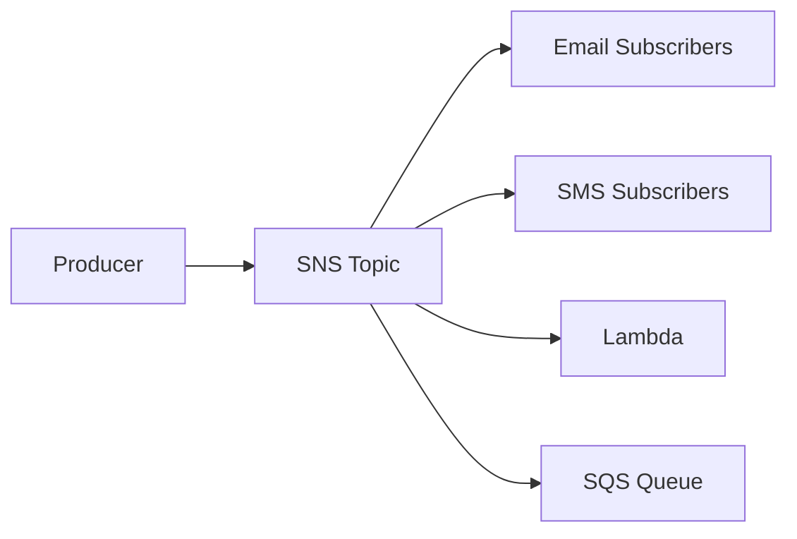

# 📣 SNS, SQS, and EventBridge

## 🧠 What is Amazon SNS?
Amazon Simple Notification Service (SNS) is a fully managed pub/sub messaging service. It allows one service to publish a message to multiple subscribers such as email, SMS, Lambda, or SQS.

### 🧩 SNS architecture view


---

## 🧠 What is Amazon SQS?
Amazon Simple Queue Service (SQS) is a fully managed message queue service. It helps decouple application components by buffering messages between producers and consumers.

### Types of queues
- Standard queues: high throughput, at-least-once delivery
- FIFO queues: ordered delivery, exactly-once processing

---

## 🧠 What is Amazon EventBridge?
EventBridge is a serverless event bus that helps connect applications using events from AWS services, SaaS apps, and custom applications.

### Common use cases
- reacting to S3 uploads
- triggering Lambda functions
- integrating different AWS services

---

## 🔄 How these services work together
A common pattern is:
1. an event is generated
2. EventBridge or SNS routes it
3. a Lambda or consumer processes it
4. messages can be stored in SQS for asynchronous handling

---

## 🧪 Practical Part

### 1. 🛠️ Manual labs
#### Lab 1: Create an SNS topic
1. Open the SNS console.
2. Click Create topic.
3. Choose Standard topic.
4. Name it demo-topic.
5. Create the topic.
6. Subscribe an email address to the topic.
7. Confirm the subscription from the email.
8. Publish a test message.

Expected result: the email receives the published message.

#### Lab 2: Create an SQS queue
1. Open the SQS console.
2. Click Create queue.
3. Choose Standard queue.
4. Name it demo-queue.
5. Create the queue.
6. Send a sample message to the queue.
7. Receive and delete the message.

Expected result: the message is stored and then received from the queue.

#### Lab 3: Create a simple event-driven workflow
1. Create an SNS topic.
2. Create an SQS queue.
3. Subscribe the queue to the topic.
4. Publish a message to the topic.
5. Check that it appears in the queue.

Expected result: the message is distributed through the queue.

### 2. 🧱 Terraform example
```hcl
terraform {
  required_providers {
    aws = {
      source  = "hashicorp/aws"
      version = "~> 5.0"
    }
  }
}

provider "aws" {
  region = "us-east-1"
}

resource "aws_sns_topic" "demo" {
  name = "demo-topic"
}

resource "aws_sqs_queue" "demo" {
  name = "demo-queue"
}
```

---

## 📝 Exam Notes
- SNS is for pub/sub notifications.
- SQS is for message buffering and decoupling.
- EventBridge is for routing events between services.
