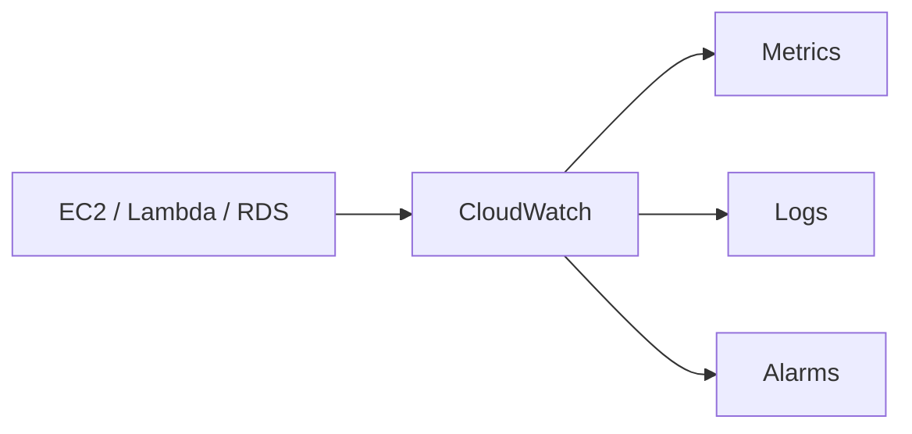

# 📈 CloudWatch and CloudTrail

## 🧠 What is CloudWatch?
CloudWatch is AWS’s monitoring and observability service. It collects metrics, logs, and events from AWS resources and applications.

### 🧩 CloudWatch architecture view


---

## 📊 Key CloudWatch Features
- Metrics: CPU utilization, network traffic, latency, and custom application metrics
- Logs: centralized log collection from EC2, Lambda, and containers
- Alarms: notify teams when thresholds are breached
- Dashboards: visual overview of health and performance

---

## 🧠 What is CloudTrail?
CloudTrail records API calls made in an AWS account, which is useful for auditing and security investigations.

### Why it matters
CloudTrail helps you answer questions like:
- who made this change?
- when was it made?
- which API action was used?

---

## 🔗 Related Services
- AWS Config: tracks configuration changes over time
- X-Ray: traces distributed applications
- SNS: sends alert notifications

---

## 🧪 Practical Part

### 1. 🛠️ Manual labs
These are written as step-by-step classroom demonstrations so students can follow them without skipping major actions.

#### Lab 1: View CloudWatch metrics for an EC2 instance
1. Open the EC2 console.
2. Select an existing EC2 instance.
3. In the monitoring tab, review CPU utilization, disk read/write, and network metrics.
4. Open the CloudWatch console.
5. Click Metrics.
6. Search for EC2 and select the instance metrics.
7. Add the CPUUtilization metric to a graph.
8. Observe the metric for a few minutes.
9. Explain what the graph means to the class.

Expected result: students can see live CPU and network metrics for the instance.

#### Lab 2: Create a CloudWatch alarm
1. In CloudWatch, go to Alarms.
2. Click Create alarm.
3. Choose the CPUUtilization metric.
4. Set the statistic to Average.
5. Set the period to 5 minutes.
6. Choose a threshold such as greater than 80%.
7. Add an action to send a notification.
8. Create a topic in SNS if needed.
9. Complete the alarm creation wizard.
10. Wait for the metric to cross the threshold or simulate load.

Expected result: an alarm is created and can notify the student when CPU usage exceeds the threshold.

#### Lab 3: Create a log group and view logs
1. Open CloudWatch.
2. Click Logs.
3. Click Create log group.
4. Name the group /aws/demo-app.
5. Launch or use an instance that can emit logs.
6. Configure the instance to send logs to the log group if required.
7. Open the log stream and inspect messages.
8. Use the filter bar to search for specific entries.

Expected result: students learn how logs are centralized and searched.

#### Lab 4: Enable CloudTrail and review events
1. Open the CloudTrail console.
2. Click Create trail if no trail exists.
3. Name the trail.
4. Choose to log management events and data events if needed.
5. Store logs in an S3 bucket.
6. Create the trail.
7. Open Event history.
8. Review recent API activity such as launching an instance or changing a security group.

Expected result: students can trace account activity and understand audit visibility.

#### Lab 5: Create a dashboard
1. In CloudWatch, go to Dashboards.
2. Click Create dashboard.
3. Name it demo-dashboard.
4. Add widgets for CPU, memory, and log activity.
5. Save the dashboard.

Expected result: students can monitor resources visually from one place.

### Student checklist
- CloudWatch metrics viewed
- Alarm created
- Log group created and inspected
- CloudTrail trail enabled
- Dashboard created
### 2. 🧱 Terraform example
```hcl
terraform {
  required_providers {
    aws = {
      source  = "hashicorp/aws"
      version = "~> 5.0"
    }
  }
}

provider "aws" {
  region = "us-east-1"
}

resource "aws_cloudwatch_log_group" "demo" {
  name = "/aws/demo"
}
```

---

## 📝 Exam Notes
- CloudWatch focuses on performance and health monitoring.
- CloudTrail focuses on audit and governance visibility.
