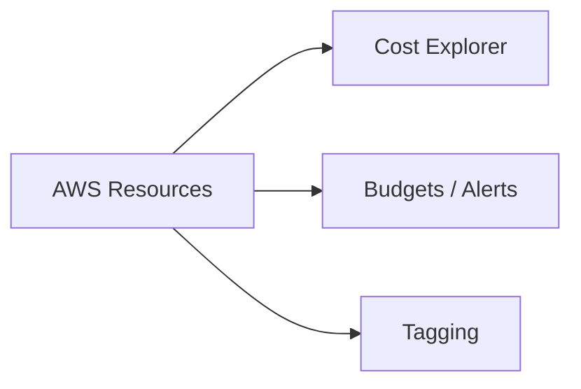

# 💰 Cost Optimization and Billing

## 🧠 Why cost optimization matters
Cloud cost management is a major part of successful AWS architecture. A service may work technically but still be expensive if not designed carefully.

### 🧩 Cost management view


---

## 📊 Cost Management Tools
- AWS Cost Explorer: view and analyze spending patterns
- AWS Budgets: set budget alerts and thresholds
- AWS Cost Anomaly Detection: identify unusual cost spikes

---

## 💡 Cost Optimization Strategies
- Right-size compute resources
- Use Savings Plans or Reserved Instances for steady workloads
- Use Spot Instances for flexible, non-critical workloads
- Enable tagging for cost allocation and accountability
- Use lifecycle rules to move old data to lower-cost storage

---

## ✅ Architecture Considerations
- Avoid over-provisioning resources
- Choose serverless or managed services when they reduce operational overhead
- Review idle resources regularly
- Use automated cleanup for test environments

---

## 🧪 Practical Part

### 1. 🛠️ Manual labs
1. Open Cost Explorer and review monthly spend.
2. Create a budget and set an alert threshold.
3. Tag resources by environment and owner.
4. Identify underused EC2 instances and stop or resize them.

### 2. 🧱 Terraform example
```hcl
terraform {
  required_providers {
    aws = {
      source  = "hashicorp/aws"
      version = "~> 5.0"
    }
  }
}

provider "aws" {
  region = "us-east-1"
}

resource "aws_instance" "example" {
  ami           = "ami-0c02fb55956c7d316"
  instance_type = "t3.micro"
  tags = {
    Environment = "dev"
    Owner       = "team-a"
  }
}
```

---

## 📝 Exam Notes
- Cost efficiency is an important part of Solution Architect decision-making.
- Good architecture balances performance, reliability, and cost.
