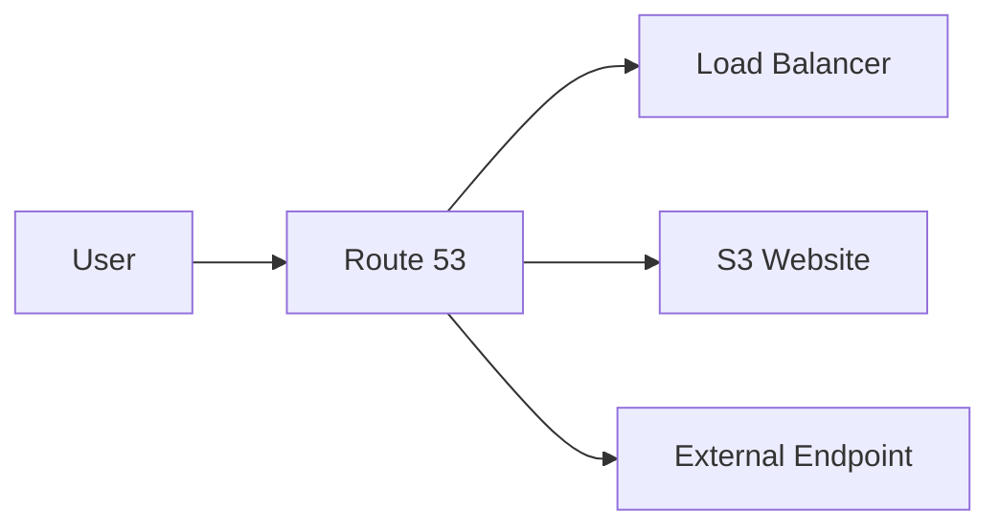

# 🌍 Route 53 and CloudFront

## 🧠 What is Amazon Route 53?
Route 53 is AWS’s DNS and domain management service. It routes traffic to AWS resources or external endpoints based on configured policies.

### 🧩 Route 53 architecture view


---

## 🧭 Routing Policies
- Simple routing
- Weighted routing
- Latency-based routing
- Failover routing
- Geolocation routing

---

## 🧠 What is Amazon CloudFront?
CloudFront is a CDN that delivers content with low latency by caching it at edge locations.

### Why it matters
CloudFront improves performance for users across regions and reduces the load on origin servers.

---

## ✅ Common Use Cases
- Static website delivery
- Media streaming
- API acceleration
- Global content delivery

---

## 🧪 Practical Part

### 1. 🛠️ Manual labs
1. Register or transfer a domain.
2. Create a Route 53 hosted zone and DNS records.
3. Point a subdomain to an S3 website or load balancer.
4. Create a CloudFront distribution for a static website.

### 2. 🧱 Terraform example
```hcl
terraform {
  required_providers {
    aws = {
      source  = "hashicorp/aws"
      version = "~> 5.0"
    }
  }
}

provider "aws" {
  region = "us-east-1"
}

resource "aws_route53_zone" "example" {
  name = "example.com"
}
```

---

## 📝 Exam Notes
- Route 53 is used for DNS and traffic routing.
- CloudFront improves performance by caching content close to users.
