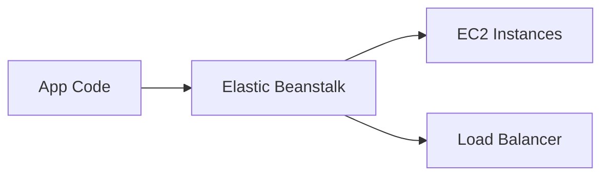

# 🚀 Elastic Beanstalk and Serverless

## 🧠 What is Elastic Beanstalk?
Elastic Beanstalk is a managed service for deploying and scaling web applications without deeply managing the underlying infrastructure.

### 🧩 Beanstalk view


---

## 🧠 Serverless Services
- AWS Lambda: run code without provisioning servers
- API Gateway: expose APIs securely
- Step Functions: orchestrate multi-step workflows
- EventBridge: connect event-driven AWS services

---

## ⚖️ When to choose each
- Elastic Beanstalk: quick deployment of standard web apps
- Serverless: event-driven, scalable, and cost-efficient applications

---

## 🧪 Practical Part

### 1. 🛠️ Manual labs
1. Deploy a sample web app using Elastic Beanstalk.
2. Review the environment and scaling settings.
3. Create a Lambda function and trigger it from an S3 event.
4. Expose the function through API Gateway.

### 2. 🧱 Terraform example
```hcl
terraform {
  required_providers {
    aws = {
      source  = "hashicorp/aws"
      version = "~> 5.0"
    }
  }
}

provider "aws" {
  region = "us-east-1"
}

resource "aws_lambda_function" "example" {
  filename         = "function.zip"
  function_name    = "example-function"
  role             = "arn:aws:iam::123456789012:role/lambda-role"
  handler          = "index.handler"
  runtime          = "python3.11"
}
```

---

## 📝 Exam Notes
- Beanstalk is easier for developers who want managed deployment.
- Serverless is ideal when you want low operational overhead and pay-per-use execution.
